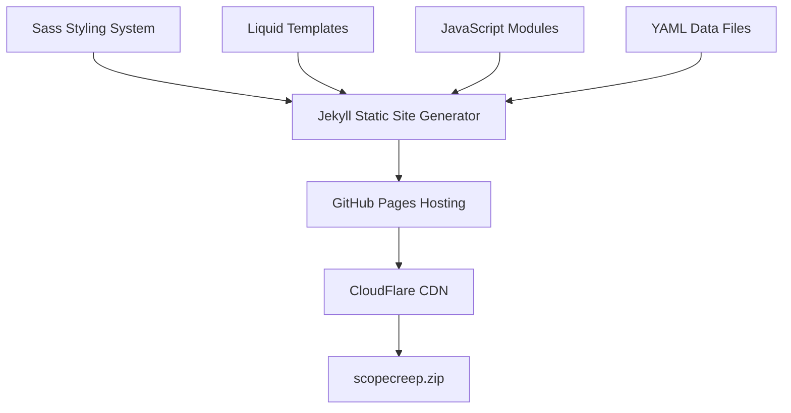

# ScopeCreep.zip Documentation

Welcome to the technical documentation for the ScopeCreep.zip website. This documentation provides detailed information for developers and maintainers.

## Documentation Structure

### 📐 [Architecture](./architecture/)
- [Overview](./architecture/overview.md) - System architecture and technology stack
- [Data Flow](./architecture/data-flow.md) - How data moves through the system
- [Collections](./architecture/collections.md) - Jekyll collections configuration

### 🚀 [Deployment](./deployment/)
- [Getting Started](./deployment/getting-started.md) - Local development setup
- [GitHub Pages](./deployment/github-pages.md) - Production deployment
- [CI/CD Pipeline](./deployment/ci-cd.md) - Automated workflows

### 🎨 [Styling](./styling/)
- [Theme System](./styling/theme-system.md) - Colors, typography, spacing
- [Component Styles](./styling/components.md) - UI component documentation
- [Animations](./styling/animations.md) - Kawaii effects and transitions

### 🧩 [Components](./components/)
- [Layout Components](./components/layouts.md) - Page templates
- [Include Components](./components/includes.md) - Reusable partials
- [JavaScript Modules](./components/javascript.md) - Interactive features

### 🎙️ [Podcast Infrastructure](./podcast-infrastructure/)
- [Podcast Features](./podcast-infrastructure/podcast-features.md) - Carousel, cards, and layouts
- [Transcript Formatting](./podcast-infrastructure/transcript-formatting-guide.md) - Clean and raw transcript guidelines
- [Implementation Guide](./podcast-infrastructure/podcast-implementation-guide.md) - Original setup documentation

### 🔧 [Maintenance](./maintenance/)
- [Content Updates](./maintenance/content-updates.md) - Adding/editing content
- [Troubleshooting](./maintenance/troubleshooting.md) - Common issues
- [Performance](./maintenance/performance.md) - Optimization tips

## Quick Links

- **Repository**: [github.com/scopecreepzip/website](https://github.com/scopecreepzip/website)
- **Live Site**: [scopecreep.zip](https://scopecreep.zip)
- **Issues**: [Report bugs or request features](https://github.com/scopecreepzip/website/issues)

## Technology Overview

## Key Features

- **Static Site Generation** - Fast, secure, and scalable
- **Component-Based Architecture** - Modular and maintainable
- **Responsive Design** - Mobile-first approach
- **Kawaii Aesthetic** - Unique visual identity
- **Podcast Integration** - Built-in podcast platform
- **SEO Optimized** - Structured data and meta tags

## Getting Help

1. Check the relevant documentation section
2. Search existing [GitHub issues](https://github.com/scopecreepzip/website/issues)
3. Contact the team at hello@scopecreep.zip

## Contributing

We welcome contributions! Please see our [contribution guidelines](./CONTRIBUTING.md) for details on:
- Code style standards
- Pull request process
- Testing requirements
- Documentation updates