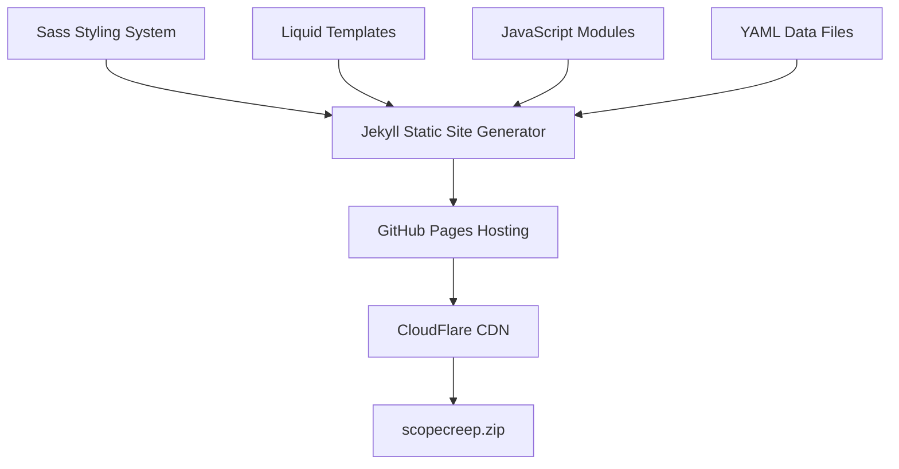

# ScopeCreep.zip Documentation

Welcome to the technical documentation for the ScopeCreep.zip website. This documentation provides detailed information for developers and maintainers.

## Documentation Structure

### 📐 [Architecture](./architecture/)
- [Overview](./architecture/overview.md) - System architecture and technology stack
- [Architecture Plan](./architecture/scopecreep_architecture.md) - Detailed architectural documentation
- [Legacy Plan](./architecture/bad_jekyll-architecture-plan.md) - Historical reference

### 🚀 [Deployment](./deployment/)
- [Getting Started](./deployment/getting-started.md) - Local development setup
- [GitHub Pages](./deployment/github-pages.md) - Production deployment

### 🎨 [Design & Styling](./design/)
- [Design System](./design/scopecreep_design_doc.md) - Complete design system documentation
- [Extracted Styling Patterns](./design/extracted-styling-patterns.md) - Style pattern reference
- [Homepage Template](./design/scopecreep_homepage-template.html) - Homepage structure reference
- [Legacy Design Doc](./design/bad-copecreep-design-document.md) - Historical reference

### 🎨 [Styling](./styling/)
- [Theme System](./styling/theme-system.md) - Tarot theme colors, typography, spacing

### 🧩 [Components](./components/)
- [Include Components](./components/includes.md) - Reusable partials and component library

### 🎙️ [Podcast Infrastructure](./podcast-infrastructure/)
- [Podcast Features](./podcast-infrastructure/podcast-features.md) - Carousel, cards, and layouts
- [Transcript Formatting](./podcast-infrastructure/transcript-formatting-guide.md) - Clean and raw transcript guidelines
- [Implementation Guide](./podcast-infrastructure/podcast-implementation-guide.md) - Original setup documentation

### 🔧 [Maintenance](./maintenance/)
- [Content Updates](./maintenance/content-updates.md) - Adding/editing content
- [Troubleshooting](./maintenance/troubleshooting.md) - Common issues

### 📝 [Prompts & Planning](./prompts/)
Historical AI prompts and planning documents (for reference)

## Quick Links

- **Repository**: [github.com/ScopeCreep-zip/website](https://github.com/ScopeCreep-zip/website)
- **Live Site**: [scopecreep.zip](https://scopecreep.zip)
- **Issues**: [Report bugs or request features](https://github.com/ScopeCreep-zip/website/issues)

## Technology Overview

## Current State (Axiom Branch)

### Theme: Tarot "As Above, So Below"
The website has been redesigned with a tarot card aesthetic featuring gold accents and a light/dark mode duality:

**Light Theme ("As Above")**:
- Warm ivory backgrounds (#FFFDF7)
- Antique gold accents (#C9A227)
- Professional business card aesthetic

**Dark Theme ("So Below")**:
- Deep purple-black backgrounds (#0D0A14)
- Gold accents (#B8A67C)
- Mystical, elegant feel

### Technology Stack
- **Framework**: Jekyll 4.x with GitHub Pages
- **Styling**: SCSS with modular architecture
  - Main component: `_sass/components/_tarot.scss` (21KB)
  - Variables: Gold-based color system
- **JavaScript**: Minimal vanilla JS
  - `main.js` - Site-wide functionality
  - `buzzword-generator.js` - Interactive content
- **Pagination**: Standard `jekyll-paginate` (GitHub Pages compatible)

### Site Structure
- **Pages**: Located in `/pages/` directory
  - `about.md` - About page
  - `blog.html` - Blog listing with pagination
  - `contact.md` - Contact page
  - `podcasts.html` - Podcast listing
  - `research.md` - Research page
- **Layouts**: All exist in `/_layouts/`
  - `default.html` - Base wrapper
  - `page.html` - Static pages
  - `post.html` - Blog posts
  - `podcast.html` - Podcast episodes
  - `home.html` - Homepage

## Key Features

- **Static Site Generation** - Fast, secure, and scalable
- **Component-Based Architecture** - Modular and maintainable
- **Responsive Design** - Mobile-first approach
- **Tarot Aesthetic** - Unique mystical professional identity
- **Podcast Integration** - Built-in podcast platform
- **SEO Optimized** - Structured data and meta tags
- **Accessibility First** - WCAG 2.1 AA compliant

## Documentation Notes

### What's Documented
- Architecture and deployment processes
- Tarot theme system with gold color palette
- Podcast infrastructure (carousel, cards, transcripts)
- Component library and includes
- Content update procedures

### Legacy vs Current
Some documentation reflects the original "kawaii pink/purple" design phase. The current implementation uses:
- **Gold color system** (not pink/purple)
- **Tarot aesthetic** (not general kawaii)
- **Minimal JavaScript** (2 files vs originally planned multiple modules)
- **Standard jekyll-paginate** (GitHub Pages compatible)

Files marked "bad-*" or in legacy sections are historical references and may not reflect current implementation.

## Getting Help

1. Check the relevant documentation section
2. Review `.claude/` directory for project instructions
3. Search existing [GitHub issues](https://github.com/ScopeCreep-zip/website/issues)
4. Contact the team at hello@scopecreep.zip