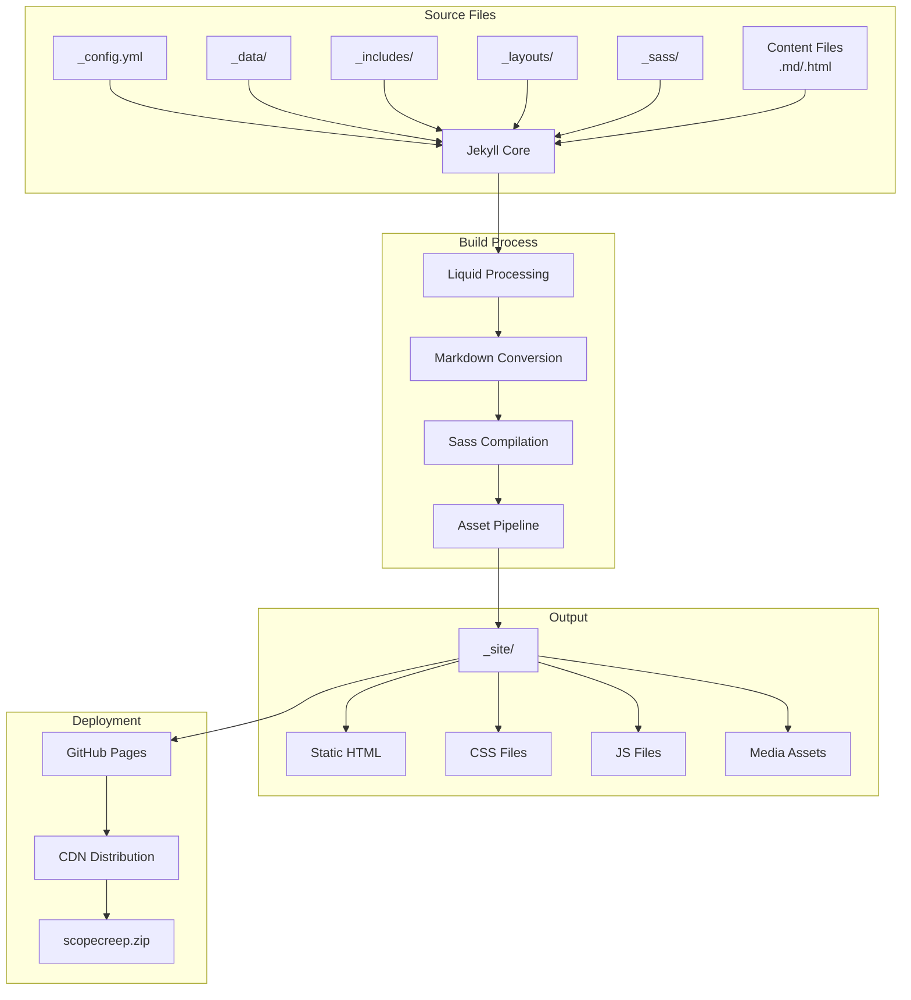
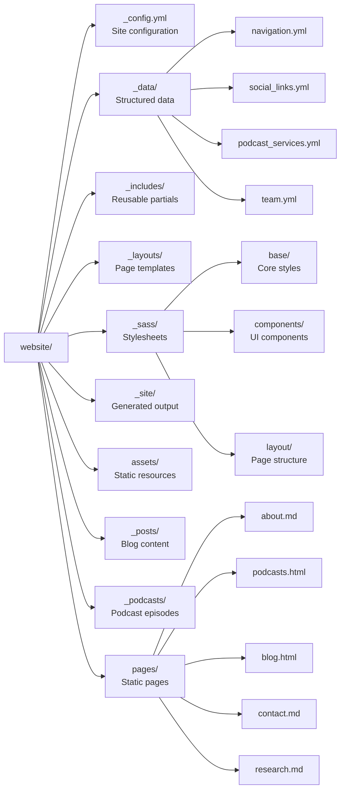
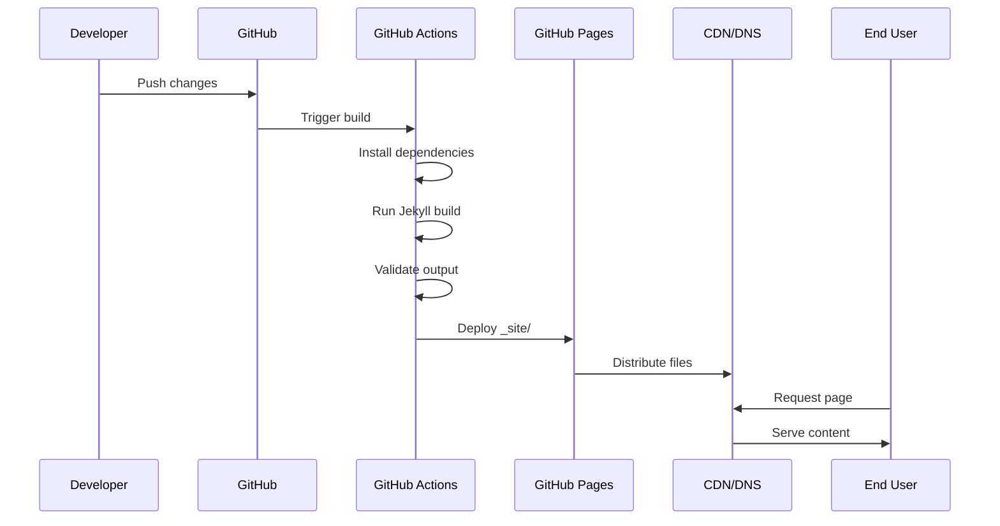

# ScopeCreep.zip Architecture Overview

## Technology Stack

### Core Framework
- **Jekyll 4.x** - Static site generator
- **Ruby 3.x** - Build environment
- **Liquid** - Templating engine
- **Sass** - CSS preprocessor

### Frontend Technologies
- **HTML5** - Semantic markup
- **CSS3** - Styling with animations
- **JavaScript (ES6+)** - Interactive features
- **Web Components** - Reusable UI elements

## Architecture Diagram

## Directory Structure

## Build Pipeline

## Key Components

### 1. Configuration Layer
- `_config.yml` - Central configuration
- Environment-specific settings
- Plugin configuration
- Build settings

### 2. Data Layer
- YAML files in `_data/`
- Structured content management
- Separation of content from presentation

### 3. Template Layer
- Layouts define page structure
- Includes provide reusable components
- Liquid templating for dynamic content

### 4. Styling Layer
- Modular Sass architecture
- Component-based styles
- Responsive design system
- Custom animations and effects

### 5. Content Layer
- Markdown files for pages
- Blog posts in `_posts/`
- Podcast episodes in `_podcasts/`
- Static pages (about, contact, etc.)

### 6. Podcast Infrastructure
- Episode carousel with rolodex effect
- Multi-view episode cards (Services/Transcripts)
- Transcript formatting system
- Speaker label color coding
- Individual episode pages with tabs

### 7. Asset Pipeline
- Minimal JavaScript (main.js, buzzword-generator.js)
- Image optimization
- Font loading (Cormorant Garamond, Quicksand, JetBrains Mono)
- CSS/JS minification via Sass compression

## Performance Optimizations

1. **Static Generation** - No server-side processing
2. **CDN Distribution** - Global edge caching
3. **Asset Optimization** - Minified CSS/JS
4. **Lazy Loading** - Images and media
5. **Critical CSS** - Inline above-fold styles
6. **Preconnect/Prefetch** - Resource hints

## Security Considerations

1. **Static Files** - No server vulnerabilities
2. **HTTPS Only** - Enforced by GitHub Pages
3. **No Database** - No SQL injection risks
4. **Content Security Policy** - XSS protection
5. **Dependency Management** - Regular updates

## Scalability

The architecture is designed for:
- **Horizontal scaling** via CDN
- **Zero server maintenance**
- **Automatic deployments**
- **Version control integration**
- **Rollback capabilities**