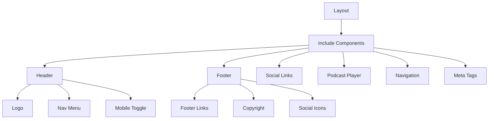
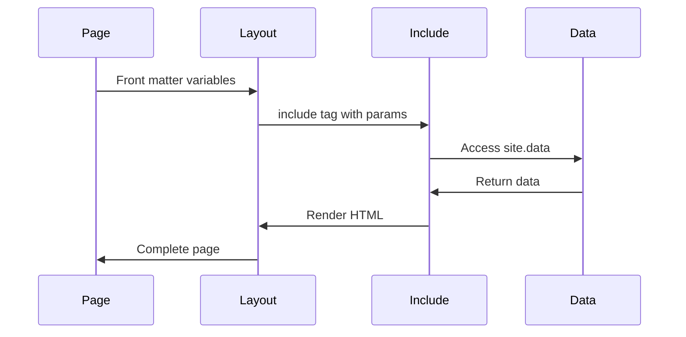
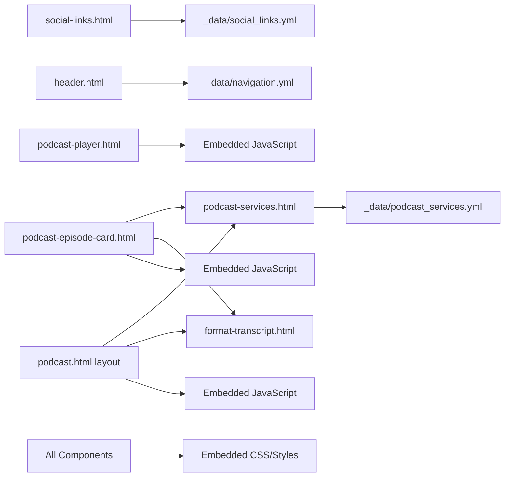

# Include Components Documentation

## Overview

Include components are reusable partials that provide consistent functionality across the site. They follow the DRY (Don't Repeat Yourself) principle and enable modular development.

## Component Architecture



## Core Components

### header.html

**Purpose**: Site-wide navigation header with responsive menu

**Location**: `_includes/header.html`

**Parameters**:
- None (uses site.data.navigation)

**Usage**:
```liquid

```

**Structure**:
```html
<header class="site-header">
  <div class="container">
    <a href="{{ '/' | relative_url }}" class="logo">
      
    </a>
    <nav class="main-nav">
      
        <a href="{{ item.url | relative_url }}" 
           class="nav-link active">
          {{ item.title }}
        </a>
      
    </nav>
    <button class="mobile-menu-toggle" aria-label="Menu">
      <span></span>
    </button>
  </div>
</header>
```

### footer.html

**Purpose**: Site footer with links and social media

**Location**: `_includes/footer.html`

**Parameters**:
- None

**Usage**:
```liquid

```

**Features**:
- Dynamic year for copyright
- Social media links from data file
- Newsletter signup
- Footer navigation

### social-links.html

**Purpose**: Reusable social media icon list

**Location**: `_includes/social-links.html`

**Parameters**:
- `class`: Additional CSS classes
- `show_labels`: Display platform names (default: false)

**Usage**:
```liquid

```

**Data Source**: `_data/social_links.yml`
```yaml
- platform: twitter
  url: https://twitter.com/scopecreepzip
  icon: fab fa-twitter
  label: Twitter
- platform: github
  url: https://github.com/ScopeCreep-zip
  icon: fab fa-github
  label: GitHub
```

### podcast-player.html

**Purpose**: Custom audio player with controls and styling

**Location**: `_includes/podcast-player.html`

**Parameters**:
- `audio_url`: URL to the audio file (required)
- `title`: Episode title (required)
- `episode_number`: Episode number (optional)
- `show_download`: Show download button (default: true)
- `show_speed`: Show playback speed control (default: true)

**Usage**:
```liquid

```

**Features**:
- Custom HTML5 audio player (native audio element hidden)
- Play/pause button with emoji icons
- Progress bar with click-to-seek
- Time display (current/total)
- Playback speed selector (0.5x to 2x)
- Download button
- Gold-themed styling matching tarot design
- Responsive layout for mobile

**File Size**: 252 lines (includes embedded styles and JavaScript)

### podcast-services.html

**Purpose**: Centralized podcast platform links with configurable display

**Location**: `_includes/podcast-services.html`

**Parameters**:
- `layout`: Display layout - "horizontal" or "vertical" (default: "horizontal")
- `size`: Button size - "small", "medium", or "large" (default: "medium")
- `show_rss`: Display RSS feed link (default: true)
- `use_data_file`: Use centralized data file (default: true)
- `title`: Optional section title

**Usage**:
```liquid

```

**Data Source**: `_data/podcast_services.yml`

**Features**:
- Centralized service configuration
- Enable/disable platforms via data file
- Gold gradient hover effects
- Platform-specific icons
- Responsive mobile layout
- Fallback to custom URLs if use_data_file=false

**Available Platforms** (configured in data file):
- Spotify
- Apple Podcasts
- Google Podcasts
- YouTube
- Amazon Music
- Overcast (disabled by default)
- Pocket Casts (disabled by default)
- Castbox (disabled by default)
- RSS Feed

**File Size**: 196 lines (includes embedded styles)

### head.html

**Purpose**: HTML head section with meta tags and assets

**Location**: `_includes/head.html`

**Parameters**:
- Inherits from page/site variables

**Usage**:
```liquid
<!DOCTYPE html>
<html lang="en">
<head>
  
</head>
```

**Features**:
- SEO meta tags
- Open Graph tags
- Twitter Cards
- Favicon links
- CSS/JS includes

## Advanced Components

### podcast-episode-card.html

**Purpose**: Full-featured episode card with multi-view interface

**Location**: `_includes/podcast-episode-card.html`

**Parameters**:
- `episode`: Episode object (required)
- `show_transcript`: Show transcript tabs (default: true)
- `show_duration`: Display episode duration (default: true)
- `card_style`: Additional CSS classes

**Usage**:
```liquid

  

```

**Features**:
- Episode artwork with fallback to site logo
- Episode metadata (number, date)
- Title, description, guest info
- Duration display
- Tag list with gold styling
- Action buttons (Listen Now, Transcript, Show Notes)
- **Three-tab view switcher**:
  - **Services Tab**: Podcast platform buttons (uses podcast-services.html)
  - **Clean Transcript Tab**: Formatted transcript preview (150 char) with scrollable view
  - **Raw Transcript Tab**: Raw transcript preview with monospace font
- Transcript previews with "Read full transcript" links
- Speaker-labeled transcript formatting (uses format-transcript.html)
- Custom gold-themed scrollbars
- Hover effects with elevation
- Responsive mobile layout

**Component Structure**:
```html
<article class="episode-card">
  <div class="episode-card__header">
    
    <div class="episode-card__meta">
      <span class="episode-card__number">Episode X</span>
      <time class="episode-card__date">Date</time>
    </div>
  </div>
  <div class="episode-card__content">
    <h3 class="episode-card__title">Title</h3>
    <p class="episode-card__description">Description</p>
    <div class="episode-card__tags">Tags</div>
  </div>
  <div class="episode-card__actions">Action buttons</div>
  <div class="episode-card__view-switcher">
    <div class="view-tabs">Three tabs</div>
    <div class="view-content">Tabbed content panes</div>
  </div>
</article>
```

**File Size**: 470 lines total
- Lines 1-120: HTML template
- Lines 122-440: Embedded styles
- Lines 442-470: JavaScript for tab switching

### format-transcript.html

**Purpose**: Format podcast transcripts with speaker labels and styling

**Location**: `_includes/format-transcript.html`

**Parameters**:
- `content`: Transcript text to format (required)
- `type`: Transcript type - "clean" or "raw" (default: "clean")

**Usage**:
```liquid


```

**Features**:
- Automatic speaker label formatting with color coding
- Timestamp wrapping for raw transcripts
- Line break preservation
- Speaker-specific color themes:
  - `[Kali]` - .speaker-label.kali (dusty rose)
  - `[Kat]` - .speaker-label.kat (teal)
  - `[Speaker 1]` - .speaker-label.speaker1 (gold dark)
  - `[Speaker 2]` - .speaker-label.speaker2 (sage)
  - `[Guest]` - .speaker-label.guest (dusty rose)
- Raw transcript timestamp styling (.timestamp class)

**Processing**:
1. Wraps speaker labels in `<span class="speaker-label [name]">`
2. For raw transcripts, wraps timestamps in `<span class="timestamp">`
3. Converts newlines to `<br>` tags
4. Returns formatted HTML for display

**File Size**: 27 lines

## Component Communication



## Best Practices

### 1. Parameter Validation

```liquid
 Validate required parameters 

  <p class="error">Error: Episode parameter required</p>

   Component logic here 

```

### 2. Default Values

```liquid
 Set defaults for optional parameters 


```

### 3. Defensive Coding

```liquid
 Check for data existence 

  
    
      <a href="{{ link.url }}">{{ link.platform }}</a>
    
  

```

### 4. Performance Optimization

```liquid
 Cache expensive operations 


   Use cached sorted posts 

```

## Creating New Components

### Component Template

```liquid

  Component: component-name.html
  Purpose: Brief description
  Parameters:
    - param1: Description (required)
    - param2: Description (optional, default: value)
  Usage: 


 Parameter validation 

  <p class="error">Error: param1 is required</p>


 Set defaults 


 Component markup 
<div class="component-name" data-param="{{ param2 }}">
  {{ include.param1 }}
</div>


```

### Testing Components

```liquid
 Test page: test-component.html 
---
layout: page
title: Component Test
---

<h2>Test Cases</h2>

 Test with all parameters 
<h3>Full Parameters</h3>


 Test with defaults 
<h3>Default Values</h3>


 Test error handling 
<h3>Error Case</h3>

```

## Component Library

### Available Components

| Component | Purpose | Key Parameters | File Size |
|-----------|---------|----------------|-----------|
| header.html | Site header | None | N/A |
| footer.html | Site footer | None | N/A |
| head.html | HTML head | None | N/A |
| social-links.html | Social media links | class, show_labels | N/A |
| podcast-player.html | Custom audio player | audio_url, title, episode_number, show_download, show_speed | 252 lines |
| podcast-services.html | Platform links | layout, size, show_rss, use_data_file, title | 196 lines |
| podcast-episode-card.html | Full episode card | episode, show_transcript, show_duration, card_style | 470 lines |
| format-transcript.html | Transcript formatter | content, type | 27 lines |

### Component Dependencies



**Note**: Podcast components use embedded `<style>` and `<script>` blocks rather than external CSS/JS files. This ensures portability and self-contained functionality.