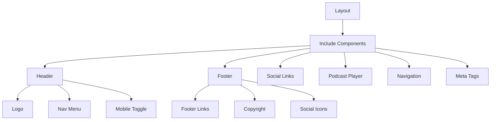
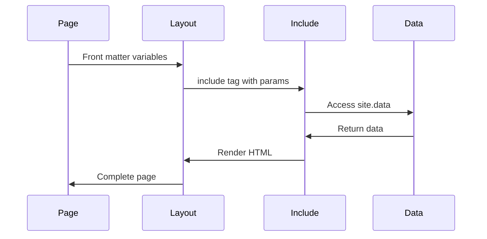
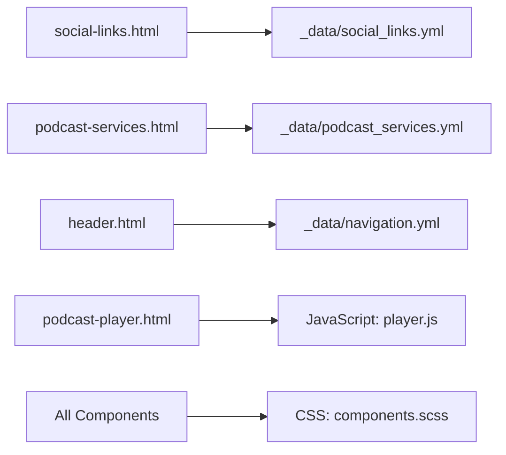

# Include Components Documentation

## Overview

Include components are reusable partials that provide consistent functionality across the site. They follow the DRY (Don't Repeat Yourself) principle and enable modular development.

## Component Architecture



## Core Components

### header.html

**Purpose**: Site-wide navigation header with responsive menu

**Location**: `_includes/header.html`

**Parameters**:
- None (uses site.data.navigation)

**Usage**:
```liquid

```

**Structure**:
```html
<header class="site-header">
  <div class="container">
    <a href="{{ '/' | relative_url }}" class="logo">
      
    </a>
    <nav class="main-nav">
      
        <a href="{{ item.url | relative_url }}" 
           class="nav-link active">
          {{ item.title }}
        </a>
      
    </nav>
    <button class="mobile-menu-toggle" aria-label="Menu">
      <span></span>
    </button>
  </div>
</header>
```

### footer.html

**Purpose**: Site footer with links and social media

**Location**: `_includes/footer.html`

**Parameters**:
- None

**Usage**:
```liquid

```

**Features**:
- Dynamic year for copyright
- Social media links from data file
- Newsletter signup
- Footer navigation

### social-links.html

**Purpose**: Reusable social media icon list

**Location**: `_includes/social-links.html`

**Parameters**:
- `class`: Additional CSS classes
- `show_labels`: Display platform names (default: false)

**Usage**:
```liquid

```

**Data Source**: `_data/social_links.yml`
```yaml
- platform: twitter
  url: https://twitter.com/scopecreepzip
  icon: fab fa-twitter
  label: Twitter
- platform: github
  url: https://github.com/scopecreepzip
  icon: fab fa-github
  label: GitHub
```

### podcast-player.html

**Purpose**: Embedded podcast player with controls

**Location**: `_includes/podcast-player.html`

**Parameters**:
- `episode`: Podcast episode object
- `autoplay`: Auto-start playback (default: false)
- `show_notes`: Display episode notes (default: true)

**Usage**:
```liquid

```

**Features**:
```html
<div class="podcast-player" data-episode="{{ episode.id }}">
  <audio controls autoplay>
    <source src="{{ episode.audio_url }}" type="audio/mpeg">
  </audio>
  <div class="player-info">
    <h3>{{ episode.title }}</h3>
    <time>{{ episode.date | date: "%B %d, %Y" }}</time>
    
      <div class="episode-notes">{{ episode.content }}</div>
    
  </div>
</div>
```

### podcast-services.html

**Purpose**: List of podcast platform links

**Location**: `_includes/podcast-services.html`

**Parameters**:
- `style`: Display style (icons/buttons/list)

**Usage**:
```liquid

```

**Data Source**: `_data/podcast_services.yml`

### head.html

**Purpose**: HTML head section with meta tags and assets

**Location**: `_includes/head.html`

**Parameters**:
- Inherits from page/site variables

**Usage**:
```liquid
<!DOCTYPE html>
<html lang="en">
<head>
  
</head>
```

**Features**:
- SEO meta tags
- Open Graph tags
- Twitter Cards
- Favicon links
- CSS/JS includes

## Advanced Components

### podcast-episode-card.html

**Purpose**: Episode preview card for listings

**Location**: `_includes/podcast-episode-card.html`

**Parameters**:
- `episode`: Episode object
- `show_thumbnail`: Display episode artwork
- `truncate`: Character limit for description

**Usage**:
```liquid

  

```

### Component Structure:
```html
<article class="episode-card">
  
    
  
  <div class="episode-content">
    <h3><a href="{{ episode.url }}">{{ episode.title }}</a></h3>
    <time>{{ episode.date | date: "%B %d, %Y" }}</time>
    <p>{{ episode.description | truncate: include.truncate }}</p>
    <div class="episode-meta">
      <span class="duration">{{ episode.duration }}</span>
      <span class="episode-number">Episode {{ episode.episode_number }}</span>
    </div>
  </div>
</article>
```

## Component Communication



## Best Practices

### 1. Parameter Validation

```liquid
 Validate required parameters 

  <p class="error">Error: Episode parameter required</p>

   Component logic here 

```

### 2. Default Values

```liquid
 Set defaults for optional parameters 


```

### 3. Defensive Coding

```liquid
 Check for data existence 

  
    
      <a href="{{ link.url }}">{{ link.platform }}</a>
    
  

```

### 4. Performance Optimization

```liquid
 Cache expensive operations 


   Use cached sorted posts 

```

## Creating New Components

### Component Template

```liquid

  Component: component-name.html
  Purpose: Brief description
  Parameters:
    - param1: Description (required)
    - param2: Description (optional, default: value)
  Usage: 


 Parameter validation 

  <p class="error">Error: param1 is required</p>


 Set defaults 


 Component markup 
<div class="component-name" data-param="{{ param2 }}">
  {{ include.param1 }}
</div>


```

### Testing Components

```liquid
 Test page: test-component.html 
---
layout: page
title: Component Test
---

<h2>Test Cases</h2>

 Test with all parameters 
<h3>Full Parameters</h3>


 Test with defaults 
<h3>Default Values</h3>


 Test error handling 
<h3>Error Case</h3>

```

## Component Library

### Available Components

| Component | Purpose | Key Parameters |
|-----------|---------|----------------|
| header.html | Site header | None |
| footer.html | Site footer | None |
| head.html | HTML head | None |
| social-links.html | Social media links | class, show_labels |
| podcast-player.html | Audio player | episode, autoplay |
| podcast-services.html | Platform links | style |
| podcast-episode-card.html | Episode preview | episode, truncate |

### Component Dependencies

