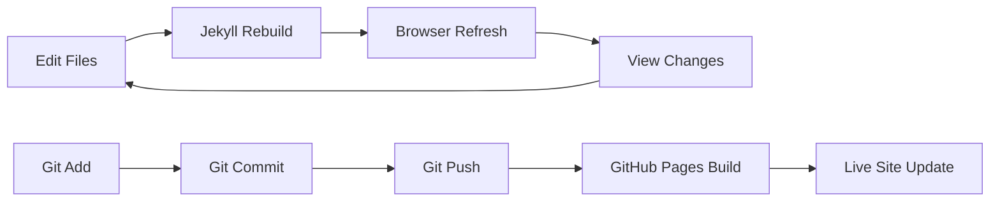

# Getting Started with Local Development

## Prerequisites

### Required Software
- **Ruby** (>= 2.7.0)
- **Bundler** (>= 2.0)
- **Git**
- **Node.js** (optional, for JS tooling)

### System Requirements
- macOS, Linux, or Windows (with WSL)
- 2GB RAM minimum
- 500MB free disk space

## Installation Steps

### 1. Clone the Repository

```bash
git clone https://github.com/ScopeCreep-zip/website.git
cd website
```

### 2. Install Ruby Dependencies

```bash
# Install bundler if not present
gem install bundler

# Install project dependencies
bundle install
```

### 3. Verify Configuration

The `_config.yml` file is already configured for both local and production use:

```yaml
# Production settings (default)
url: "https://scopecreep.zip"
baseurl: ""

# These settings work for local development too
# Jekyll automatically uses localhost:4000 when running locally
```

No configuration changes needed for local development!

## Development Workflow



### Start Development Server

```bash
# Basic serve command
bundle exec jekyll serve

# With live reload
bundle exec jekyll serve --livereload

# With drafts
bundle exec jekyll serve --drafts

# On custom port
bundle exec jekyll serve --port 3000
```

### Common Development Tasks

#### Creating a New Page

```bash
# Create page in pages/ directory
touch pages/new-page.md

# Add front matter
echo '---
layout: page
title: "New Page"
permalink: /new-page/
---' > pages/new-page.md
```

Pages are organized in the `pages/` directory with explicit `permalink` values in their front matter.

#### Adding a Blog Post

```bash
# Create post with proper naming
touch _posts/2025-01-20-post-title.md

# Add front matter
echo '---
layout: post
title: "Post Title"
date: 2025-01-20
categories: [security, engineering]
---' > _posts/2025-01-20-post-title.md
```

#### Working with Sass

```scss
// Files in _sass/ are automatically compiled
// Import in main.scss
@import "components/new-component";
```

## Project Structure

```
website/
├── _config.yml          # Site configuration
├── _data/              # YAML data files (team, navigation, speaking)
├── _includes/          # Reusable components (12 templates)
├── _layouts/           # Page templates (4 layouts)
├── _posts/             # Blog posts (YYYY-MM-DD-title.md format)
├── _podcasts/          # Podcast episodes collection
├── _speaking/          # Speaking engagements collection
├── _sass/              # Sass partials (modular structure)
│   ├── base/
│   ├── components/
│   ├── layout/
│   └── utilities/
├── _site/              # Generated output (gitignored)
├── assets/             # Static files
│   ├── css/
│   ├── js/
│   └── images/
├── pages/              # Static pages with explicit permalinks
├── docs/               # Documentation (excluded from build)
├── Gemfile             # Ruby dependencies
└── .github/workflows/  # GitHub Actions deployment
```

## Environment Variables

```bash
# Set Jekyll environment
JEKYLL_ENV=development bundle exec jekyll serve

# Production build
JEKYLL_ENV=production bundle exec jekyll build
```

## Build Commands

### Development Build
```bash
bundle exec jekyll build
```

### Production Build
```bash
JEKYLL_ENV=production bundle exec jekyll build
```

### Clean Build
```bash
bundle exec jekyll clean
bundle exec jekyll build
```

## Debugging

### Enable Verbose Output
```bash
bundle exec jekyll serve --verbose
```

### Check Configuration
```bash
bundle exec jekyll doctor
```

### Validate HTML
```bash
bundle exec htmlproofer ./_site
```

## Performance Tips

1. **Incremental Builds**
   ```bash
   bundle exec jekyll serve --incremental
   ```

2. **Limit Posts**
   ```bash
   bundle exec jekyll serve --limit_posts 10
   ```

3. **Profile Build**
   ```bash
   bundle exec jekyll build --profile
   ```

## Common Issues

### Bundle Install Fails
```bash
# Update bundler
gem update bundler

# Clear cache
rm -rf vendor/bundle
bundle install
```

### Port Already in Use
```bash
# Find process using port 4000
lsof -i :4000

# Kill process
kill -9 <PID>

# Or use different port
bundle exec jekyll serve --port 4001
```

### Sass Compilation Errors
```bash
# Clear Sass cache
rm -rf .sass-cache
rm -rf _site
bundle exec jekyll build
```

## Next Steps

- Read [GitHub Pages Deployment](./github-pages.md)
- Learn about [CI/CD Pipeline](./ci-cd.md)
- Explore [Component Documentation](../components/)