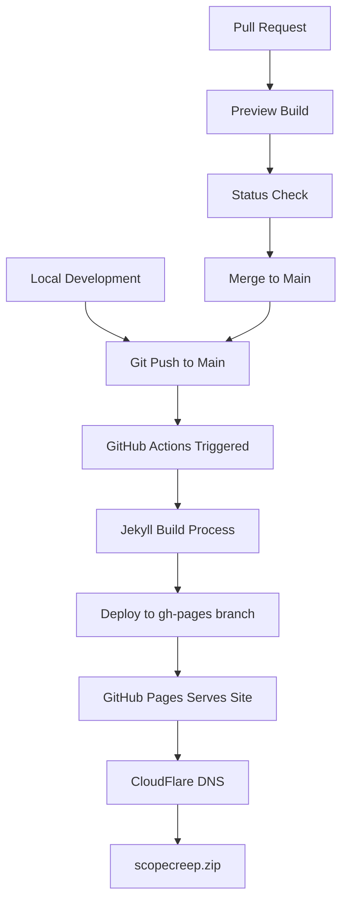
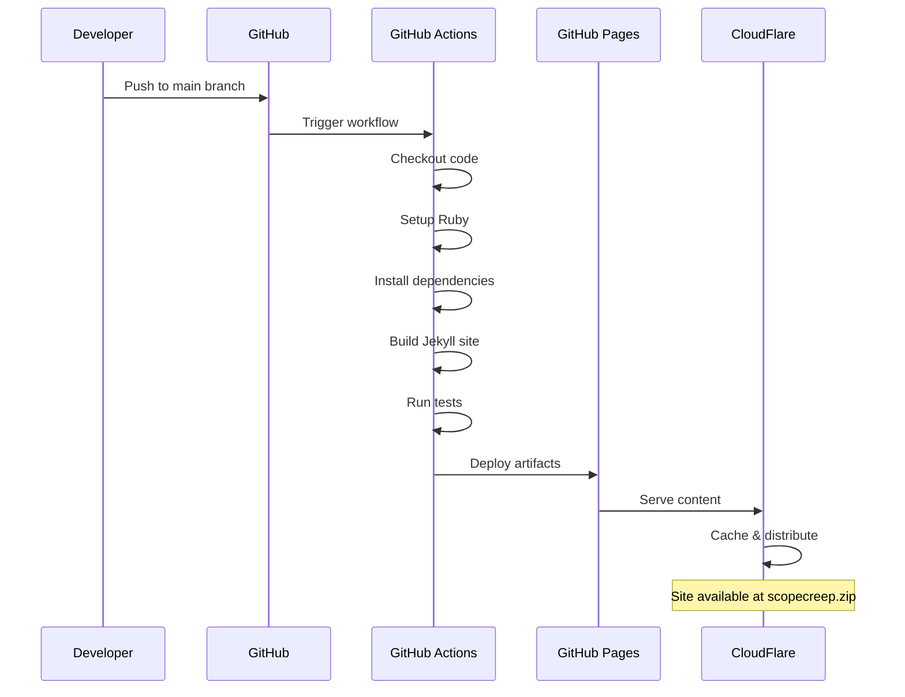

# GitHub Pages Deployment

## Overview

ScopeCreep.zip is hosted on GitHub Pages with a custom domain. The deployment process is automated through GitHub Actions.

## Deployment Architecture



## Repository Settings

### GitHub Pages Configuration

1. **Source**: Deploy from a branch
2. **Branch**: `gh-pages` / `root`
3. **Custom Domain**: `scopecreep.zip`
4. **Enforce HTTPS**: ✅ Enabled

### Required Files

#### CNAME File
```
scopecreep.zip
```

#### .nojekyll (if using custom build)
```
# Empty file to bypass Jekyll processing
```

## GitHub Actions Workflow

### Basic Deployment Workflow

```yaml
name: Deploy to GitHub Pages

on:
  push:
    branches: [main]
  workflow_dispatch:

permissions:
  contents: read
  pages: write
  id-token: write

concurrency:
  group: "pages"
  cancel-in-progress: false

jobs:
  build:
    runs-on: ubuntu-latest
    steps:
      - name: Checkout
        uses: actions/checkout@v4
        
      - name: Setup Ruby
        uses: ruby/setup-ruby@v1
        with:
          ruby-version: '3.1'
          bundler-cache: true
          
      - name: Setup Pages
        uses: actions/configure-pages@v4
        
      - name: Build with Jekyll
        env:
          JEKYLL_ENV: production
        run: bundle exec jekyll build
        
      - name: Upload artifact
        uses: actions/upload-pages-artifact@v3

  deploy:
    environment:
      name: github-pages
      url: ${{ steps.deployment.outputs.page_url }}
    runs-on: ubuntu-latest
    needs: build
    steps:
      - name: Deploy to GitHub Pages
        id: deployment
        uses: actions/deploy-pages@v4
```

## Custom Domain Setup

### DNS Configuration

#### A Records (Apex Domain)
```
Type: A
Name: @
Value: 185.199.108.153
       185.199.109.153
       185.199.110.153
       185.199.111.153
```

#### CNAME Record (www subdomain)
```
Type: CNAME
Name: www
Value: scopecreepzip.github.io
```

### Verification Steps

```bash
# Check DNS propagation
dig scopecreep.zip

# Verify HTTPS
curl -I https://scopecreep.zip

# Check redirect
curl -I http://scopecreep.zip
```

## Deployment Process



## Production Configuration

### _config.yml Settings

```yaml
# Production settings
url: "https://scopecreep.zip"
baseurl: ""
environment: production

# Optimization
sass:
  style: compressed

# Plugins for GitHub Pages
plugins:
  - jekyll-feed
  - jekyll-seo-tag
  - jekyll-sitemap

# Exclude development files
exclude:
  - Gemfile
  - Gemfile.lock
  - node_modules
  - vendor
  - .sass-cache
  - docs/
  - README.md
```

## Monitoring Deployment

### GitHub Actions Status

```bash
# Check workflow runs
gh run list --workflow=deploy.yml

# View specific run
gh run view <run-id>

# Watch live logs
gh run watch <run-id>
```

### Build Status Badge

```markdown

```

## Rollback Procedure

### Quick Rollback

```bash
# Revert last commit
git revert HEAD
git push origin main

# Or reset to specific commit
git reset --hard <commit-hash>
git push --force origin main
```

### Manual Deployment

```bash
# Trigger workflow manually
gh workflow run deploy.yml

# Or via GitHub UI
# Actions → Deploy to GitHub Pages → Run workflow
```

## Performance Optimization

### Cache Headers

```html
<!-- In _includes/head.html -->
<meta http-equiv="Cache-Control" content="public, max-age=3600">
<link rel="preconnect" href="https://fonts.googleapis.com">
<link rel="dns-prefetch" href="https://cdn.jsdelivr.net">
```

### Asset Optimization

```yaml
# In _config.yml
jekyll-minifier:
  exclude: 'feed.xml'
  compress_css: true
  compress_javascript: true
  compress_json: true
  compress_html: true
```

## Security Best Practices

1. **Environment Secrets**
   - Never commit sensitive data
   - Use GitHub Secrets for API keys
   - Rotate credentials regularly

2. **Dependency Updates**
   ```yaml
   - name: Dependabot
     uses: dependabot/dependabot-core@v1
   ```

3. **Content Security Policy**
   ```html
   <meta http-equiv="Content-Security-Policy" 
         content="default-src 'self'; script-src 'self' 'unsafe-inline';">
   ```

## Troubleshooting

### Build Failures

1. **Check GitHub Actions logs**
2. **Verify Gemfile.lock is committed**
3. **Ensure all plugins are GitHub Pages compatible**
4. **Test locally with same Ruby version**

### Domain Issues

1. **Verify CNAME file exists**
2. **Check DNS propagation (24-48 hours)**
3. **Ensure HTTPS is enabled in settings**
4. **Clear browser cache**

### 404 Errors

1. **Check baseurl configuration**
2. **Verify permalink structure**
3. **Ensure proper file extensions**
4. **Check for case sensitivity**

## Useful Commands

```bash
# Check site status
curl -I https://scopecreep.zip

# Validate deployment
curl https://api.github.com/repos/ScopeCreep-zip/website/pages

# Force rebuild
# Add empty commit
git commit --allow-empty -m "Trigger rebuild"
git push origin main
```