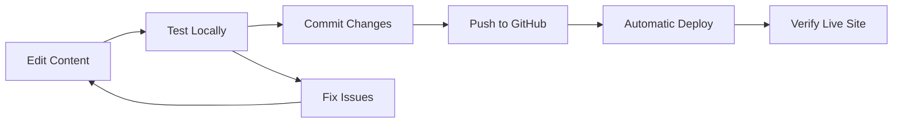
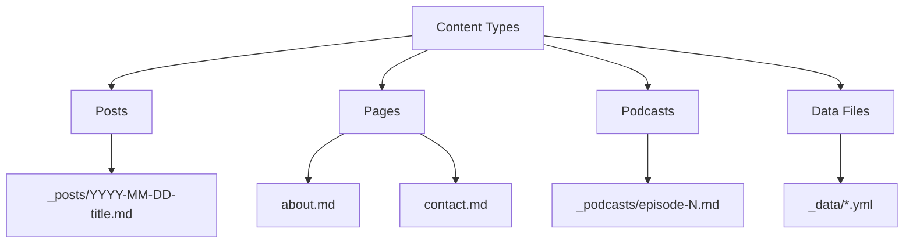

# Content Updates Guide

## Overview

This guide covers common content update tasks for maintaining the ScopeCreep.zip website. All content is managed through markdown files and YAML data files.

## Content Update Workflow



## Common Tasks

### Adding a Blog Post

1. **Create Post File**
```bash
# Format: YYYY-MM-DD-title-slug.md
touch _posts/2025-01-20-new-security-research.md
```

2. **Add Front Matter**
```yaml
---
layout: post
title: "New Security Research: Supply Chain Vulnerabilities"
date: 2025-01-20 10:00:00 -0700
categories: [security, research]
tags: [supply-chain, vulnerabilities, malware]
author: kali
excerpt: "Exploring recent supply chain attack vectors..."
image: /assets/images/posts/supply-chain.jpg
---
```

3. **Write Content**
```markdown
## Introduction

Your post content here using Markdown...

### Code Examples
```python
def analyze_supply_chain():
    # Your code here
    pass
```

### Images

```

### Adding a Podcast Episode

1. **Create Episode File**
```bash
touch _podcasts/episode-10-platform-engineering.md
```

2. **Episode Front Matter**
```yaml
---
layout: podcast
title: "EP10: Platform Engineering Best Practices"
date: 2025-01-20
episode_number: 10
duration: "45:32"
audio_url: /assets/audio/episodes/ep10.mp3
spotify_url: https://open.spotify.com/episode/...
apple_url: https://podcasts.apple.com/...
description: "Deep dive into platform engineering with special guest..."
guests:
  - name: "Jane Doe"
    twitter: "@janedoe"
    bio: "Platform Engineer at TechCorp"
show_notes: |
  - Introduction [00:00]
  - Platform Engineering Overview [05:30]
  - Best Practices Discussion [15:00]
  - Q&A Session [35:00]
---
```

### Updating Team Information

**File**: `_data/team.yml`

```yaml
kali:
  name: "Kali Jackson"
  title: "Malware Analyst & Security Researcher"
  avatar: "/assets/images/avatars/kali.png"
  bio: "Updated bio text here..."
  credentials: 
    - "GIAC GREM"
    - "OSCP"
    - "New Certification"  # Add new items
  social:
    blog: "https://radicalkjax.com"
    research: "https://malwarEvangelist.com"
    bluesky: "https://bsky.app/profile/radicalkjax.com"
    mastodon: "https://infosec.exchange/@kali"  # Add new platforms
```

### Managing Speaking Events

**File**: `_data/speaking.yml`

```yaml
- title: "Kawaii Security: Making InfoSec Accessible"
  event: "DEF CON 32"
  date: 2025-08-10
  location: "Las Vegas, NV"
  type: "talk"
  slides_url: "/assets/slides/defcon32-kawaii-security.pdf"
  video_url: "https://youtube.com/watch?v=..."
  description: "45-minute talk on making security approachable"
  
- title: "Platform Engineering Workshop"
  event: "KubeCon NA 2025"
  date: 2025-11-15
  location: "Chicago, IL"
  type: "workshop"
  registration_url: "https://kubecon.io/register"
  status: "upcoming"  # upcoming, completed, cancelled
```

### Updating Navigation

**File**: `_data/navigation.yml`

```yaml
main:
  - title: Home
    url: /
  - title: About
    url: /about/
  - title: Blog
    url: /blog/
  - title: Podcast
    url: /podcasts/
  - title: Speaking
    url: /speaking/
  - title: New Section  # Add new menu item
    url: /new-section/
    
footer:
  - title: Privacy Policy
    url: /privacy/
  - title: Contact
    url: /contact/
```

## Content Organization



## Front Matter Reference

### Post Front Matter
```yaml
---
layout: post
title: "Post Title"
date: YYYY-MM-DD HH:MM:SS +/-TTTT
categories: [category1, category2]
tags: [tag1, tag2, tag3]
author: kali|kat
excerpt: "Brief description for listings"
image: /assets/images/feature.jpg
comments: true
featured: true
---
```

### Page Front Matter
```yaml
---
layout: page
title: "Page Title"
permalink: /custom-url/
description: "SEO meta description"
image: /assets/images/page-hero.jpg
---
```

### Podcast Front Matter
```yaml
---
layout: podcast
title: "Episode Title"
date: YYYY-MM-DD
episode_number: N
season: N
duration: "HH:MM:SS"
audio_url: /path/to/audio.mp3
explicit: false
keywords: [keyword1, keyword2]
sponsors:
  - name: "Sponsor Name"
    url: "https://sponsor.com"
    message: "Special offer..."
---
```

## Media Management

### Image Organization
```
assets/images/
├── avatars/        # Team member photos
├── posts/          # Blog post images
├── podcasts/       # Episode artwork
├── logos/          # Brand assets
└── misc/           # Other images
```

### Image Optimization

```bash
# Before uploading, optimize images
# Install: brew install imageoptim-cli
imageoptim assets/images/posts/*.{jpg,jpeg,png}

# Or use online tools:
# - tinypng.com
# - squoosh.app
```

### Audio File Guidelines

- **Format**: MP3, 128kbps minimum
- **Metadata**: Include episode info
- **Naming**: `ep{number}-{slug}.mp3`
- **Storage**: Consider external hosting for large files

## Data File Formats

### Social Links (`_data/social_links.yml`)
```yaml
- platform: twitter
  url: https://twitter.com/username
  icon: fab fa-twitter
  label: Twitter
  color: "#1DA1F2"
```

### Recognition (`_data/recognition.yml`)
```yaml
- title: "Best Security Podcast 2024"
  organization: "InfoSec Awards"
  year: 2024
  link: https://infosecawards.com/winners/2024
  category: podcast
```

## SEO Best Practices

### Meta Tags
```yaml
# In front matter
title: "Descriptive Title | ScopeCreep.zip"
description: "160-character meta description"
image: /assets/images/og-image.jpg  # 1200x630px
keywords: [relevant, search, terms]
```

### URL Structure
```yaml
# Good permalinks
permalink: /blog/security-research-2025/
permalink: /podcast/ep10-platform-engineering/

# Avoid
permalink: /p?id=123
permalink: /post.php?title=something
```

## Content Validation

### Local Testing Checklist

- [ ] Jekyll builds without errors
- [ ] All links work (internal and external)
- [ ] Images display correctly
- [ ] Mobile responsive layout
- [ ] Meta tags populated
- [ ] RSS feed validates

### Pre-Deploy Verification

```bash
# Build and check
bundle exec jekyll build
bundle exec htmlproofer ./_site

# Check for broken links
bundle exec jekyll serve
# Visit http://localhost:4000/admin/links
```

## Troubleshooting

### Common Issues

1. **Build Fails**
```bash
# Check for syntax errors
bundle exec jekyll doctor

# Verbose output
bundle exec jekyll build --verbose
```

2. **Missing Images**
- Check file paths (case-sensitive)
- Verify file exists in repo
- Use relative_url filter: `{{ '/path/to/image' | relative_url }}`

3. **Date Parsing Errors**
- Use ISO 8601 format: `2025-01-20 10:00:00 -0700`
- Ensure proper timezone offset

4. **Liquid Syntax Errors**
- Escape special characters: `{{ example }}`
- Check for unclosed tags

## Quick Reference

### Markdown Shortcuts

```markdown
# Headers
## Subheader
**Bold** and *Italic*
[Link text](https://example.com)

`inline code`
> Blockquote
- Bullet list
1. Numbered list
--- (horizontal rule)
```

### Liquid Filters

```liquid
{{ site.time | date: "%B %d, %Y" }}
{{ page.title | upcase }}
{{ content | markdownify }}
{{ page.url | relative_url }}
{{ description | truncate: 160 }}
```

### YAML Tips

```yaml
# Multi-line strings
description: |
  Line 1
  Line 2
  
# Single line, preserve newlines  
description: >
  This will be
  a single line
  
# Lists
tags: [tag1, tag2]
# or
tags:
  - tag1
  - tag2
```