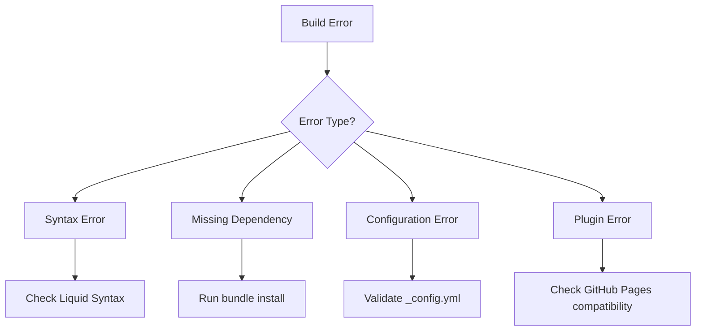
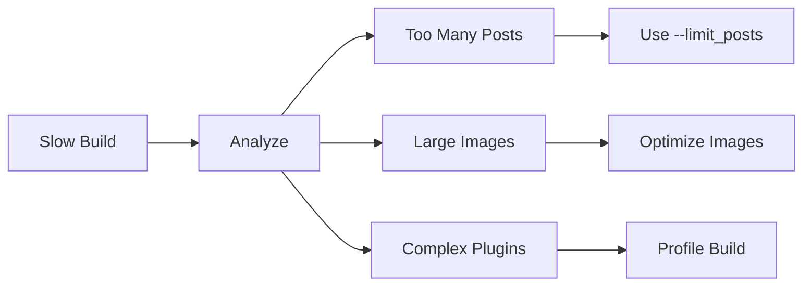

# Troubleshooting Guide

## Build Errors

### Jekyll Build Failures



#### Liquid Syntax Errors

**Error**: `Liquid syntax error: Tag was not properly terminated`

**Solution**:
```liquid
 Wrong 
 
  {{ item }}
  
 Correct 
 
  {{ item }}

```

#### YAML Parse Errors

**Error**: `Error: could not read file: Invalid YAML`

**Common Causes**:
```yaml
# Wrong - tabs instead of spaces
about:
	title: "About"  # Tab character
  
# Correct - use spaces
about:
  title: "About"  # 2 spaces

# Wrong - unquoted special characters
title: ScopeCreep: The Best
  
# Correct - quote special characters
title: "ScopeCreep: The Best"
```

#### Missing Dependencies

**Error**: `Could not find gem 'jekyll-paginate'`

**Solution**:
```bash
# Update Gemfile
echo 'gem "jekyll-paginate"' >> Gemfile

# Install dependencies
bundle install

# Add to _config.yml
plugins:
  - jekyll-paginate
```

### Deployment Issues

#### GitHub Pages Build Failures

**Check Build Status**:
```bash
# Via GitHub CLI
gh run list --workflow=pages-build-deployment

# Check specific run
gh run view <run-id>
```

**Common Fixes**:

1. **Unsupported Plugins**
```yaml
# _config.yml - Use only GitHub Pages supported plugins
plugins:
  - jekyll-feed
  - jekyll-seo-tag
  - jekyll-sitemap
  # Remove unsupported plugins
```

2. **Invalid Permalinks**
```yaml
# Wrong - no leading slash
permalink: about/

# Correct
permalink: /about/
```

#### Custom Domain Issues

**Problem**: Site not accessible at custom domain

**Debugging Steps**:
```bash
# 1. Check DNS records
dig scopecreep.zip

# 2. Verify CNAME file exists
cat CNAME

# 3. Check HTTPS certificate
curl -I https://scopecreep.zip

# 4. Test redirect
curl -I http://scopecreep.zip
```

## Performance Issues

### Slow Build Times



**Optimization Strategies**:

```bash
# 1. Profile the build
bundle exec jekyll build --profile

# 2. Limit posts in development
bundle exec jekyll serve --limit_posts 20

# 3. Use incremental builds
bundle exec jekyll serve --incremental

# 4. Exclude unnecessary files
# In _config.yml:
exclude:
  - node_modules
  - vendor
  - .sass-cache
  - docs
```

### Large Site Size

**Check Site Size**:
```bash
# After build
du -sh _site/
du -sh _site/* | sort -hr | head -20
```

**Reduce Size**:
```bash
# Optimize images
find assets/images -type f \( -name "*.jpg" -o -name "*.png" \) -exec imageoptim {} \;

# Minify CSS/JS (in _config.yml)
sass:
  style: compressed

plugins:
  - jekyll-minifier
```

## Display Issues

### CSS Not Loading

**Symptoms**: Site appears unstyled

**Debug Steps**:
```liquid
<!-- Check asset URLs in _includes/head.html -->
<link rel="stylesheet" href="{{ '/assets/css/main.css' | relative_url }}">

<!-- NOT -->
<link rel="stylesheet" href="/assets/css/main.css">
```

**Common Fixes**:
```yaml
# _config.yml for subdirectory hosting
baseurl: "/subdirectory"
url: "https://example.com"

# For root domain
baseurl: ""
url: "https://scopecreep.zip"
```

### Missing Images

**Debug Checklist**:
- [ ] File exists in repository
- [ ] Correct file extension (case-sensitive)
- [ ] Using relative_url filter
- [ ] File not in .gitignore

```liquid
<!-- Correct image reference -->


<!-- For posts/pages -->

```

### Responsive Layout Issues

**Mobile Menu Not Working**:
```javascript
// Check console for errors
// Ensure main.js is loaded
document.addEventListener('DOMContentLoaded', function() {
  const toggle = document.querySelector('.mobile-menu-toggle');
  const nav = document.querySelector('.main-nav');
  
  if (toggle && nav) {
    toggle.addEventListener('click', () => {
      nav.classList.toggle('active');
    });
  }
});
```

## Content Issues

### Posts Not Appearing

**Checklist**:
- [ ] Correct filename format: `YYYY-MM-DD-title.md`
- [ ] Post date not in future
- [ ] Valid front matter
- [ ] File in `_posts/` directory
- [ ] Not in draft status

```bash
# Debug posts
bundle exec jekyll build --verbose
bundle exec jekyll serve --drafts  # Include draft posts
```

### Broken Internal Links

**Find Broken Links**:
```bash
# Install htmlproofer
gem install html-proofer

# Check internal links
htmlproofer ./_site --disable-external --assume-extension

# Check all links
htmlproofer ./_site
```

### RSS Feed Issues

**Validate Feed**:
```bash
# Build site
bundle exec jekyll build

# Validate feed.xml
xmllint --noout _site/feed.xml

# Or use online validator
# https://validator.w3.org/feed/
```

## Development Environment Issues

### Ruby Version Conflicts

```bash
# Check Ruby version
ruby -v

# Use rbenv to manage versions
rbenv install 3.0.0
rbenv local 3.0.0

# Or use rvm
rvm use 3.0.0
```

### Bundle Install Failures

```bash
# Clear bundle cache
rm -rf vendor/bundle
rm Gemfile.lock

# Reinstall
bundle install

# Platform-specific issues
bundle lock --add-platform x86_64-linux
bundle install
```

### Port Already in Use

```bash
# Find process using port 4000
lsof -i :4000

# Kill process
kill -9 <PID>

# Or use different port
bundle exec jekyll serve --port 4001
```

## Common Error Messages

### "No such file or directory"

```bash
# Check working directory
pwd

# Ensure you're in project root
cd /path/to/website
bundle exec jekyll serve
```

### "Invalid date"

```yaml
# Wrong date formats
date: 01/20/2025        # Wrong
date: 2025-20-01        # Wrong
date: 2025-01-20        # Correct
date: 2025-01-20 10:00:00 -0700  # With time
```

### "Tag on line X was not properly closed"

```liquid
<!-- Check for unclosed tags -->

  Content
  <!-- Don't forget this -->

<!-- Escape Liquid in code blocks -->

  {{ example code }}

```

## Debugging Tools

### Jekyll Doctor

```bash
bundle exec jekyll doctor

# Common warnings and fixes:
# "Found no _config.yml" - Create config file
# "URL is not set" - Add url to _config.yml
# "Folder _plugins exists" - Remove if using GitHub Pages
```

### Verbose Output

```bash
# Maximum debugging info
bundle exec jekyll build --verbose --trace

# Show Liquid rendering
bundle exec jekyll build --profile
```

### Browser Developer Tools

```javascript
// Add debug info to templates
console.log('Page data:', {
  title: '{{ page.title }}',
  layout: '{{ page.layout }}',
  categories: {{ page.categories | jsonify }}
});
```

## Emergency Fixes

### Site Completely Broken

```bash
# 1. Revert to last working commit
git log --oneline
git checkout <last-working-commit>

# 2. Clean build
bundle exec jekyll clean
bundle exec jekyll build

# 3. If still broken, start minimal
mv _config.yml _config.yml.backup
echo "title: Test" > _config.yml
bundle exec jekyll serve
```

### Quick Rollback

```bash
# Create backup branch
git checkout -b backup-current-state

# Return to main and reset
git checkout main
git reset --hard HEAD~1
git push --force origin main
```

## Getting Help

### Resources

1. **Jekyll Documentation**: https://jekyllrb.com/docs/
2. **GitHub Pages Docs**: https://docs.github.com/pages
3. **Stack Overflow**: Tag `jekyll`
4. **Jekyll Forum**: https://talk.jekyllrb.com/

### Debug Information to Provide

When seeking help, include:

```markdown
**Environment:**
- OS: [e.g., macOS 13.0]
- Ruby: [output of `ruby -v`]
- Jekyll: [output of `jekyll -v`]
- Bundler: [output of `bundle -v`]

**Error Message:**
```
[Full error output]
```

**Relevant Files:**
- _config.yml (sensitive data removed)
- Gemfile
- Problem file content

**Steps to Reproduce:**
1. [First step]
2. [Second step]
3. [Error occurs]
```