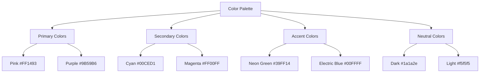
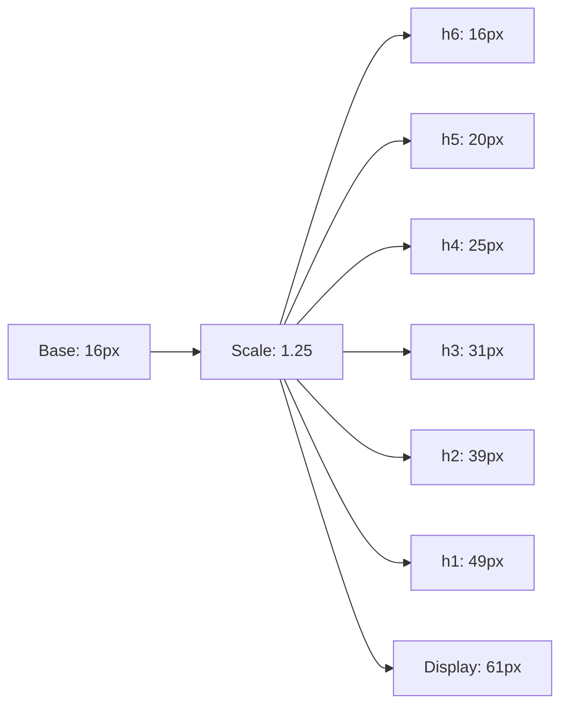

# Theme System Documentation

## Design Philosophy

ScopeCreep.zip combines professional cybersecurity aesthetics with kawaii elements, creating a unique visual identity that's both technically credible and creatively engaging.

## Color System



### CSS Variables

```scss
// _sass/base/_variables.scss

// Primary Palette
$primary-pink: #FF1493;
$primary-purple: #9B59B6;
$primary-dark: #1a1a2e;
$primary-light: #f5f5f5;

// Accent Colors
$accent-cyan: #00CED1;
$accent-magenta: #FF00FF;
$accent-neon: #39FF14;
$accent-electric: #00FFFF;

// Gradients
$gradient-kawaii: linear-gradient(135deg, $primary-pink 0%, $primary-purple 100%);
$gradient-cyber: linear-gradient(135deg, $accent-cyan 0%, $accent-electric 100%);
$gradient-dark: linear-gradient(135deg, #0f0f23 0%, $primary-dark 100%);

// Shadows
$shadow-neon: 0 0 20px rgba($accent-neon, 0.5);
$shadow-soft: 0 4px 6px rgba(0, 0, 0, 0.1);
$shadow-deep: 0 10px 30px rgba(0, 0, 0, 0.3);
```

## Typography System

### Font Stack

```scss
// Primary Font - Modern Sans
$font-primary: 'Inter', -apple-system, BlinkMacSystemFont, 'Segoe UI', sans-serif;

// Monospace - Code/Technical
$font-mono: 'JetBrains Mono', 'Fira Code', Consolas, monospace;

// Display - Kawaii Headers
$font-display: 'Quicksand', 'Comic Sans MS', cursive;

// Font Sizes (Fluid Typography)
$font-sizes: (
  'xs': clamp(0.75rem, 2vw, 0.875rem),
  'sm': clamp(0.875rem, 2.5vw, 1rem),
  'base': clamp(1rem, 3vw, 1.125rem),
  'lg': clamp(1.125rem, 3.5vw, 1.25rem),
  'xl': clamp(1.25rem, 4vw, 1.5rem),
  '2xl': clamp(1.5rem, 5vw, 2rem),
  '3xl': clamp(2rem, 6vw, 3rem),
  '4xl': clamp(2.5rem, 8vw, 4rem)
);
```

### Typography Scale



## Spacing System

### Base Unit: 8px

```scss
$spacing: (
  '0': 0,
  '1': 0.25rem,  // 4px
  '2': 0.5rem,   // 8px
  '3': 0.75rem,  // 12px
  '4': 1rem,     // 16px
  '5': 1.25rem,  // 20px
  '6': 1.5rem,   // 24px
  '8': 2rem,     // 32px
  '10': 2.5rem,  // 40px
  '12': 3rem,    // 48px
  '16': 4rem,    // 64px
  '20': 5rem,    // 80px
  '24': 6rem     // 96px
);

// Usage
.component {
  padding: map-get($spacing, '4');
  margin-bottom: map-get($spacing, '8');
}
```

## Component Styling Patterns

### Card Component

```scss
.card {
  background: $primary-light;
  border-radius: 1rem;
  padding: map-get($spacing, '6');
  box-shadow: $shadow-soft;
  transition: all 0.3s ease;
  
  &:hover {
    transform: translateY(-4px);
    box-shadow: $shadow-deep;
  }
  
  &--kawaii {
    background: $gradient-kawaii;
    color: white;
    
    &::before {
      content: '✨';
      position: absolute;
      top: -10px;
      right: -10px;
      font-size: 2rem;
      animation: sparkle 2s infinite;
    }
  }
}
```

### Button Styles

```scss
.btn {
  // Base styles
  display: inline-block;
  padding: 0.75em 1.5em;
  border-radius: 2rem;
  font-weight: 600;
  text-decoration: none;
  transition: all 0.3s ease;
  
  // Primary variant
  &--primary {
    background: $gradient-kawaii;
    color: white;
    box-shadow: 0 4px 15px rgba($primary-pink, 0.3);
    
    &:hover {
      transform: translateY(-2px);
      box-shadow: 0 6px 20px rgba($primary-pink, 0.4);
    }
  }
  
  // Cyber variant
  &--cyber {
    background: $primary-dark;
    color: $accent-neon;
    border: 2px solid $accent-neon;
    box-shadow: $shadow-neon;
    
    &:hover {
      background: $accent-neon;
      color: $primary-dark;
      text-shadow: none;
    }
  }
}
```

## Kawaii Effects

### Animated Elements

```scss
// Sparkle animation
@keyframes sparkle {
  0%, 100% { opacity: 1; transform: scale(1) rotate(0deg); }
  50% { opacity: 0.5; transform: scale(1.2) rotate(180deg); }
}

// Floating animation
@keyframes float {
  0%, 100% { transform: translateY(0); }
  50% { transform: translateY(-20px); }
}

// Pulse animation
@keyframes pulse {
  0% { transform: scale(1); }
  50% { transform: scale(1.05); }
  100% { transform: scale(1); }
}

// Usage
.kawaii-element {
  animation: float 3s ease-in-out infinite;
  
  &:hover {
    animation: pulse 0.5s ease;
  }
}
```

### Emoji Decorations

```scss
.emoji-decoration {
  &::before {
    content: attr(data-emoji);
    position: absolute;
    font-size: 2rem;
    animation: float 3s ease-in-out infinite;
  }
  
  &[data-emoji="sparkles"]::before { content: '✨'; }
  &[data-emoji="hearts"]::before { content: '💕'; }
  &[data-emoji="stars"]::before { content: '⭐'; }
  &[data-emoji="rainbow"]::before { content: '🌈'; }
}
```

## Responsive Design

### Breakpoints

```scss
$breakpoints: (
  'xs': 320px,
  'sm': 640px,
  'md': 768px,
  'lg': 1024px,
  'xl': 1280px,
  '2xl': 1536px
);

// Mixin for media queries
@mixin breakpoint($size) {
  @media (min-width: map-get($breakpoints, $size)) {
    @content;
  }
}

// Usage
.container {
  padding: map-get($spacing, '4');
  
  @include breakpoint('md') {
    padding: map-get($spacing, '8');
  }
  
  @include breakpoint('lg') {
    padding: map-get($spacing, '12');
  }
}
```

## Dark Mode Support

```scss
// CSS Variables for theme switching
:root {
  --bg-primary: #{$primary-light};
  --text-primary: #{$primary-dark};
  --accent: #{$primary-pink};
}

[data-theme="dark"] {
  --bg-primary: #{$primary-dark};
  --text-primary: #{$primary-light};
  --accent: #{$accent-neon};
}

// Component usage
.themed-component {
  background: var(--bg-primary);
  color: var(--text-primary);
  
  a {
    color: var(--accent);
  }
}
```

## Accessibility Considerations

### Focus States

```scss
// Visible focus for keyboard navigation
:focus {
  outline: 3px solid $accent-electric;
  outline-offset: 2px;
}

// Skip to content link
.skip-link {
  position: absolute;
  left: -9999px;
  
  &:focus {
    position: fixed;
    top: 1rem;
    left: 1rem;
    z-index: 9999;
    padding: 1rem;
    background: $primary-dark;
    color: white;
  }
}
```

### Color Contrast

```scss
// Ensure WCAG AA compliance
@function contrast-ratio($bg, $fg) {
  // Calculate contrast ratio
  @return (luminance($bg) + 0.05) / (luminance($fg) + 0.05);
}

// High contrast mode
@media (prefers-contrast: high) {
  :root {
    --bg-primary: white;
    --text-primary: black;
    --accent: #0066cc;
  }
}
```

## Performance Optimizations

### Critical CSS

```scss
// Above-the-fold styles
.critical {
  // Minimal reset
  * { margin: 0; padding: 0; box-sizing: border-box; }
  
  // Base typography
  body { font-family: $font-primary; line-height: 1.6; }
  
  // Hero section
  .hero { 
    min-height: 100vh;
    background: $gradient-dark;
  }
}
```

### CSS Custom Properties for Animation

```scss
// GPU-accelerated properties
.optimized-animation {
  transform: translateZ(0); // Force GPU layer
  will-change: transform;
  
  // Use transform instead of position
  &:hover {
    transform: translateX(10px);
  }
}
```